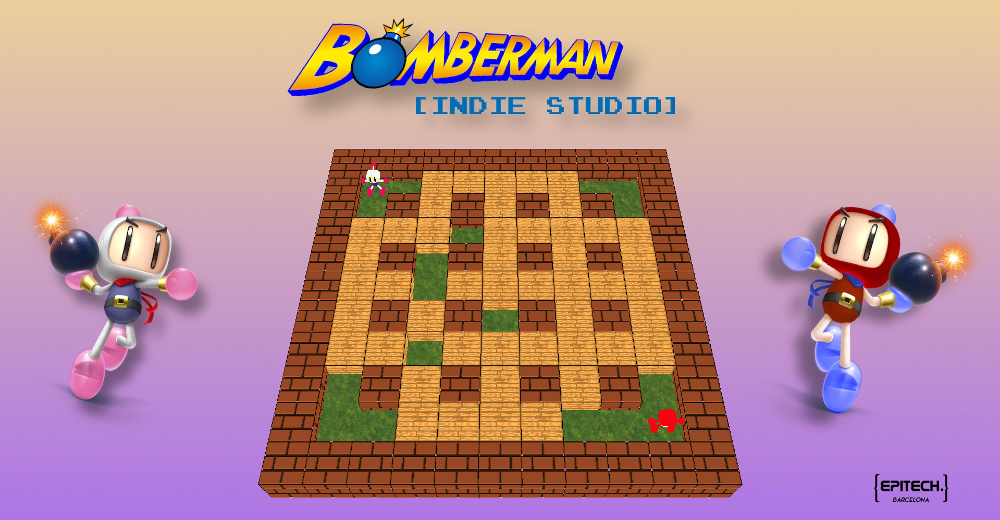

# Bomberman [ Indie Studio ] :copyright:

## :dart: Goal of the project

The aim of the Indie Studio is to implement a cross-platform 3D video game with real-world tools.
We used the [CPP language](https://en.wikipedia.org/wiki/C%2B%2B) and the [raylib](https://www.raylib.com/) library to make it.

## Build and run

### Linux

``` bash
mkdir build
cd build
cmake ..
make
./bomberman

or

cmake -DCMAKE_BUILD_TYPE=Debug -B build -S .; cd build; make; cd ../; ./build/bomberman
```

## :seedling: How to play

### Player 1

- `w`: Go up
- `s`: Go down
- `a`: Go left
- `d`: Go right
- `e`: Plant the bomb

### Player 2

- `up arrow`: Go up
- `down arrow`: Go down
- `left arrow`: Go left
- `right arrow`: Go right
- `right shift`: Plant the bomb

## :blossom: Information about the game

- In this game, you have a load and save system.
- You can choose between playing against your friend in local or play against a very smart AI.
- The aim of the game is to plant bombs near your enemies and manage to kill them.
- You can also press the `esc` button in game to go back to the menu and restart a game if you want.

## :eyes: Take a look

### Menu


## Game


## :trollface: Contributors
[Enzo Bonato](https://github.com/EnzoBonato)

[Miguel Arnalot](https://github.com/miguelarnalot)

[Blanca Sibecas](https://github.com/bsibecas)

[Angel Halouane](https://github.com/angeleads)

[Josep Teruel](https://github.com/Josep-teruel-surra)

[Todor Zugic](https://github.com/todorzugic)

[Mohamed Ghalab](https://github.com/pogz-Ghalab)
